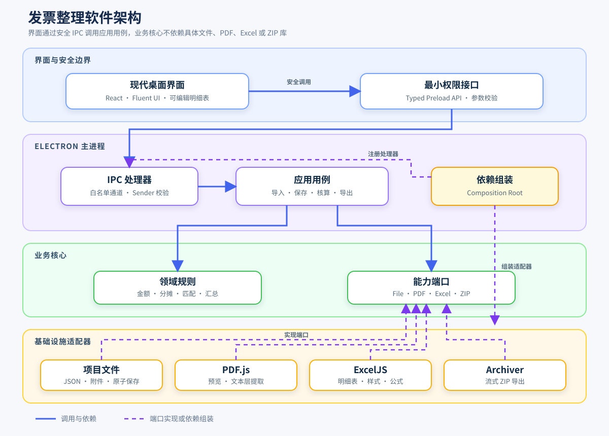

# 发票整理软件需求与依赖分析

## 1. 项目目标

在 Ubuntu 环境下开发面向 Windows 10/11 x64 的现代桌面软件，用于整理发票和支付截图、维护并可视化报销明细、执行金额核算，最终导出包含报销明细表、发票及可选支付截图的 ZIP 压缩包。

推荐采用 **Electron + React + TypeScript + Fluent UI**：Electron 支持使用单套前端代码构建 Windows 和 Linux 桌面应用，`electron-builder` 支持在 Linux 中通过 Wine Docker 镜像构建 Windows NSIS 安装包；项目必须避免依赖没有 Windows 预构建产物的原生 Node 模块，否则 Linux 到 Windows 的交叉构建会受到目标平台编译限制。

参考资料：

- [Electron 官方文档](https://www.electronjs.org/docs/latest/)
- [electron-builder 跨平台构建](https://www.electron.build/docs/features/multi-platform-build/)
- [Tauri Windows Installer](https://v2.tauri.app/distribute/windows-installer/)

Tauri 不作为首选：其官方文档将 Linux 到 Windows NSIS 交叉编译定义为带限制且测试较少的最后选择，同时 MSI 只能在 Windows 上生成。

## 2. 范围与假设

### 2.1 当前范围

- 单用户离线使用，发票和支付截图不上传服务器。
- 开发环境为 Ubuntu，目标运行环境为 Windows 10/11 x64。
- 一个报销项目支持不超过 1000 条明细、附件总量不超过 5 GB。
- 当前不接入税务平台、财务系统、审批平台和云同步服务。
- OCR、发票真伪查验、二维码识别和自动匹配不是首版强制功能。

### 2.2 核心业务流程

```text
创建报销项目
→ 拖入发票和支付截图
→ 预览、分类、录入金额
→ 关联报销明细
→ 核对差额和汇总
→ 导出 Excel 与附件压缩包
```

## 3. 功能需求

### 3.1 P0：首版必须实现

#### 项目管理

- 新建、打开、另存和删除报销项目。
- 首页提供“从本地打开”入口；项目工具栏将“从本地打开”集成到最近项目下拉菜单。
- 实际付款人名单保存为应用级设置，所有项目共用，明细只能从名单中选择。
- 自动保存和异常恢复。
- 工具栏不提供手动保存按钮，编辑停止 1 秒后自动保存，导出前强制保存。
- 所有数据和附件保存在用户选择的本地项目目录。
- 导入时复制文件到项目目录，不修改用户原始文件。

#### 文件导入

- 支持拖拽和文件选择。
- 发票支持 PDF、JPG、JPEG、PNG、WebP。
- 支付凭证支持 JPG、JPEG、PNG、WebP、PDF。
- 根据文件内容检测类型，不只依据扩展名。
- 使用 SHA-256 检测重复文件。
- 中文文件名、长文件名和同名文件不得导致覆盖。

#### 报销明细表

按照参考截图实现以下字段：

- 类别
- 日期
- 详细名称
- 金额：价格、税费、总价
- 实际付款
- 实际付款人
- 备注
- 已报销状态
- 发票
- 支付截图

表格必须支持：

- 单元格编辑、批量编辑、排序和筛选。
- 自定义费用类别。
- 行新增、复制、删除和撤销。
- 金额差异、缺失附件和重复发票提示。
- 大表虚拟滚动。

#### 附件管理

- 明细可以没有发票，也可以没有支付截图；两类附件相互独立。
- 没有发票时标记为“无发票”；支付截图是否存在不影响实际付款金额计算。
- 一条明细可以关联多张发票和多张支付截图。
- 一张合并支付截图可以关联多条明细。
- 发票和支付截图支持逐个打开、删除关联；共享附件仍被其他明细引用时必须保留。
- 支持 PDF 分页预览、图片缩放和旋转。
- 发票和支付截图分别显示匹配状态。

#### 汇总核算

- 按类别统计金额。
- 统计实际付款、有发票金额和无发票金额。
- 按实际付款人统计付款合计，未指定付款人的付款单独汇总。
- 统计未报销金额和已报销金额。
- 实际付款固定等于价格与税费之和，不单独录入。
- 所有金额使用整数“分”保存，禁止使用浮点数直接参与核算。

#### 导出

默认压缩包结构：

```text
报销项目_YYYYMMDD.zip
├── 报销明细表.xlsx
├── 发票/                     # 实际存在发票时生成
│   └── 001_物品名称.pdf
├── 支付截图/                 # 用户选择包含且实际存在时生成
│   └── 001_物品名称.png
```

导出要求：

- Excel 布局、合并表头、颜色和汇总区匹配参考模板。
- 发票和支付截图统一使用三位序号加物品名称命名，即 `001_物品名称.原扩展名`；序号按各自目录内的文件顺序生成。
- 支付截图由用户在导出时选择是否包含。
- 无发票明细允许核算和导出，并在明细表及汇总区计入“无发票金额”。
- 项目不存在发票时不生成发票目录；支付截图目录仍为可选。
- ZIP 必须流式生成，禁止将全部附件一次性加载到内存。
- 导出前检查缺失文件、金额异常和非法文件名。

### 3.2 P1：第二阶段

- 提取 PDF 文本层中的日期、号码、金额和税额。
- 根据金额、日期和商户推荐发票与支付截图的关联关系。
- 批量重命名和批量分类。
- 项目备份、恢复及导入历史。
- Excel 模板配置。
- 发票号码重复检测。

### 3.3 P2：真实样本验证后实施

- OCR 已实现 PDF 与图片发票的金额、税额和价税合计预填，并在覆盖已有金额前确认；其他字段和支付截图识别仍待实施。
- 发票二维码识别。
- 发票真伪在线查验。
- 多人协作、云同步和审批流程。

OCR 已使用 15 张人工核对的真实电子发票完成 PP-OCRv5 mobile、PP-OCRv6 tiny 和 PP-OCRv6 small 同条件测试；三者六项字段均为 15/15，PP-OCRv6 tiny 平均 0.455 秒、ONNX 模型 5.95 MiB，在当前样本集上速度和体积最优，因此进入应用集成。

### 3.4 OCR 部署与资源约束

最终集成方案为 **PP-OCRv6 tiny 检测/识别模型 + ONNX Runtime WebAssembly**，原因如下：

- PP-OCRv6 tiny 与 small、PP-OCRv5 mobile 在当前 15 张样本的字段准确率相同，但 tiny 的模型体积最小、CPU 推理最快。
- `onnxruntime-web` 官方支持在 Electron 前端运行，可以使用 WASM CPU 推理，不依赖 Python、PaddlePaddle、CUDA、Visual C++ 运行库或 Windows 原生 Node 扩展。
- Linux 和 Windows 使用相同 WASM、ONNX 模型及 JavaScript 前后处理代码，降低 Ubuntu 到 Windows 打包差异。
- 使用 `onnxruntime-web/wasm` 条件导入，并只打包实际需要的 WASM 文件、模型和中文字典，不同时携带 Tesseract、Paddle Runtime 和多套模型。

当前结论只适用于已核对的 15 张电子发票，扫描件、拍照件和 Windows 目标机器仍需扩充盲测与验收。[ONNX Runtime Web Electron 部署](https://onnxruntime.ai/docs/tutorials/web/)、[ONNX Runtime Web 精简部署](https://onnxruntime.ai/docs/tutorials/web/deploy.html)

离线资源目录固定为：

```text
public/ocr/                       # 源资源，构建后复制到 dist/ocr/
├── ort-wasm-simd-threaded.mjs
├── ort-wasm-simd-threaded.wasm
├── text-detection.onnx
├── text-recognition.onnx
├── character-dictionary.txt
├── model-config.json
└── checksums.json
```

运行策略：

1. 数字 PDF 优先提取文本层，只有扫描 PDF、图片发票和支付截图进入 OCR，避免无意义推理。
2. OCR 在独立 Web Worker 中执行，Renderer 主线程只接收进度和结果，界面不得因识别阻塞。
3. 同一时刻只处理一张图片，任务队列并发数固定为 1，禁止为每个附件创建 Worker。
4. WASM 默认最多使用 2 个线程；低资源模式使用 1 个线程，禁止自动占满全部逻辑核心。ONNX Runtime Web 支持通过 `ort.env.wasm.numThreads` 明确限制线程数。[ONNX Runtime Web性能设置](https://onnxruntime.ai/docs/tutorials/web/performance-diagnosis.html)
5. 模型首次使用时再加载并复用同一推理 Session；队列清空 5 分钟后释放 Session 和图片缓冲区。
6. 图片逐张解码，超过 2000 万像素时等比例缩小，禁止把整个项目的原始图片同时放入内存。
7. 默认只使用 CPU/WASM，不启用 WebGPU；WebGPU 只有在独立兼容性和资源测试通过后才能作为可选加速项。
8. 模型完全随安装包离线提供，不在首次运行时联网下载；启动推理前校验 `checksums.json`。

Windows 目标资源上限属于项目验收门槛，不是模型官方指标：

| 指标 | 首轮门槛 |
|---|---:|
| OCR 并发任务 | 1 |
| WASM 最大线程数 | 2 |
| OCR 额外峰值内存 | 不超过 512 MB |
| 空闲 CPU | 接近 0，禁止后台持续轮询 |
| 单张图片 P95 耗时 | 不超过 3 秒 |
| OCR 安装包增量 | 不超过 100 MB |
| 连续处理稳定性 | 1000 张无崩溃、无持续内存增长 |

准确率门槛：

- 总价、税额等金额字段精确到分的准确率不低于 99.5%。
- 日期、发票号码和交易单号字段准确率不低于 98%。
- 单据全部必填字段通过率不低于 95%。
- OCR 只在明细金额为零且首次关联发票时预填，已有金额不得覆盖，用户可继续修改预填结果。

正式安装包只保留 PP-OCRv6 tiny；其他候选只保留基准结果，不随应用打包。

## 4. 界面需求

### 4.1 主界面

- 整体采用 Windows 11 Fluent 视觉：Segoe UI Variable、Mica 式浅色背景、低层级阴影、8–12px 圆角和系统强调色。
- 项目、类别和付款人下拉统一使用 Fluent `Select`，操作入口使用 Fluent `Button`，删除确认使用 Fluent `Dialog`；日期使用 Fluent `Input` 承载系统日期能力。
- 顶部：项目操作、导入、校验和导出工具栏。
- 使用系统标题栏承载窗口标题，隐藏原生菜单栏，不在页面工具栏重复显示软件标题。
- 始终可见的统一设置入口包含全局付款人和当前项目类别设置。
- 已打开项目可在统一设置中修改项目名称，保存后同步最近项目和导出名称；项目目录路径保持不变。
- 类别和付款人均支持在设置中增删；已被当前项目明细引用的类别禁止删除，已被任一已知项目引用的付款人禁止从全局名单删除，且至少保留一个项目类别。
- 不显示项目路径与状态混排的状态栏；设置位于右上角，操作结果使用自动消失的浮层提示。
- 左侧主区域：可编辑报销明细表。
- 右侧区域：类别合计、实际付款、有发票金额、无发票金额和总额核算卡片。
- 详情抽屉：显示当前明细字段、关联发票、支付截图和差额。
- 附件预览区：支持 PDF 翻页、图片缩放和旋转。

### 4.2 交互要求

- 文件可以拖入指定明细，也可以先导入待整理区后再关联。
- 自动推荐的关联关系必须经用户确认，不得直接修改核算结果。
- 删除明细不得直接删除共享附件；只有附件不再被任何明细引用时才允许删除。
- 导出前展示校验结果和最终文件清单。
- 发票和支付截图位于操作列之前的倒数第三、倒数第二列，不在表格前部重复显示。
- “已报销”和“发票”列之间保留可见分隔与点击缓冲，防止附件操作误触报销复选框。
- 表格使用固定且与内容匹配的列宽、统一控件高度和单元格内边距，名称与备注列优先获得横向空间。
- 表格输入控件必须受所属列宽约束，禁止日期、名称等输入框溢出到相邻单元格。
- 最近项目选择器打开项目后显示当前项目名称，切换后同步更新名称。
- ZIP 不包含 JSON；导出完成后询问是否打开导出目录。
- “包含支付截图”选项及附件重命名说明显示在导出确认窗口，不归入全局设置。

## 5. 数据模型

| 实体 | 关键字段 |
|---|---|
| ReimbursementProject | id、名称、创建时间、模板版本、导出配置 |
| AppSettings | 全局付款人名单、最近项目路径、最后打开时间 |
| ExpenseItem | id、类别、日期、名称、金额、税额、实际付款人、备注、报销状态 |
| Invoice | id、附件、号码、日期、价款、税额、总额、有效状态 |
| Payment | id、附件、付款时间、商户、付款金额、交易号 |
| InvoiceAllocation | expenseId、invoiceId、分配金额 |
| PaymentAllocation | expenseId、paymentId、分配金额 |
| Attachment | id、SHA-256、原始名称、内部路径、MIME、大小 |
| Category | id、名称、排序、颜色 |
| ExportRecord | 导出时间、选项、文件路径、校验摘要 |

发票、支付凭证和报销明细之间使用分配表表达多对多关系，不在明细中只保存单个 `invoiceId` 或 `paymentId`。

数据约束：`InvoiceAllocation` 和 `PaymentAllocation` 数量都允许为零；实际付款由明细价格与税费自动计算，不保存可独立修改的实际付款字段。

## 6. 待确认核算规则

已确认：实际付款固定为“价格＋税费”；整条明细存在发票关联时计入有发票金额，否则计入无发票金额，不处理发票金额与明细金额不一致的场景。

参考截图无法证明以下业务含义，在确认前不得固化为计算代码：

1. “价格、税费、总价”分别代表发票价税还是报销可抵扣成本。
2. 多张发票对应一次付款时，税额如何分摊。
3. 作废、红冲和重复发票是否计入“有发票金额”。
4. “已报销”是布尔状态，还是需要报销日期、批次和实际报销金额。
5. Excel 必须像素级复刻参考截图，还是保持字段、样式结构和计算结果一致即可。

## 7. 软件架构



推荐目录：

```text
src/
├── main/             # Electron 主进程、窗口、IPC 注册
├── preload/          # 最小权限 API
├── renderer/         # React 界面，不访问 Node.js
├── domain/           # 金额、匹配、核算规则
├── application/      # 导入、保存、导出用例及端口
├── infrastructure/   # 文件、PDF、Excel、ZIP 实现
└── shared/           # IPC DTO 与校验 Schema
```

Renderer 必须启用沙箱和上下文隔离，只通过白名单 preload API 操作文件；同时限制导航、校验 IPC sender，不向 Renderer 直接暴露 `ipcRenderer`。

安全参考：

- [Electron Security](https://www.electronjs.org/docs/latest/tutorial/security)
- [Electron Context Isolation](https://www.electronjs.org/docs/latest/tutorial/context-isolation)

## 8. 数据存储方案

### 8.1 Windows 路径分层

安装程序采用当前用户安装模式，不要求管理员权限；安装目录只保存程序文件，禁止把项目、发票、支付截图或用户配置写入安装目录。

| 数据类型 | Windows 路径 | 生命周期与用途 |
|---|---|---|
| 程序文件 | `%LOCALAPPDATA%\Programs\InvoiceManager\` | 由 NSIS 安装和升级，应用运行时只读 |
| 应用配置 | `app.getPath('userData')`，默认对应 `%APPDATA%\InvoiceManager\` | 保存设置、最近项目和窗口状态，不保存发票等大文件 |
| 日志 | `app.getPath('logs')` | 保存运行日志，默认位于 `userData` 内，按大小和日期轮转 |
| 临时与 Session 数据 | `app.getPath('temp')\InvoiceManager\` | 保存 Chromium Session、导入临时文件和未完成导出，启动时清理过期内容 |
| 项目数据 | 默认 `app.getPath('documents')\发票整理\Projects\项目名称.invoice-project\` | 保存项目业务数据和附件；用户创建项目时可以选择其他本地目录 |
| 导出文件 | 默认 `app.getPath('documents')\发票整理\Exports\` | 保存最终 Excel 和 ZIP，界面记住用户最后一次导出位置 |

不能把 `C:\Users\用户名\Documents` 写死在代码中，因为 Windows“文档”目录可以被系统或 OneDrive 重定向；必须通过 Electron `app.getPath('documents')` 获取。Electron 官方同时说明 `userData` 适合应用配置，但不适合保存大文件，因此发票、截图和项目附件必须放在独立项目目录。[Electron app.getPath](https://www.electronjs.org/docs/latest/api/app#appgetpathname)

应用不使用 Cookie 或 localStorage 保存业务数据；主进程必须在 Electron `ready` 事件之前，把 `sessionData` 设置到 `app.getPath('temp')\InvoiceManager\Session`，避免 Chromium 缓存写入 `%APPDATA%`。

NSIS 构建配置固定为：

```yaml
nsis:
  oneClick: true
  perMachine: false
  deleteAppDataOnUninstall: false
```

- `perMachine: false`：只为当前 Windows 用户安装，不需要管理员权限。
- `deleteAppDataOnUninstall: false`：卸载程序时保留应用设置。
- 无论卸载选项如何，卸载程序都不得删除 `Documents\发票整理`、用户另外选择的项目目录或导出目录。

### 8.2 应用配置目录

`%APPDATA%\InvoiceManager\` 只保存小型配置：

```text
%APPDATA%\InvoiceManager\
├── settings.json             # 全局付款人、最近项目路径及最后打开时间
├── window-state.json         # 窗口大小和位置
└── logs/                     # 运行日志，不记录发票正文和支付信息
```

- `settings.json` 中的最近项目只是索引，不包含项目明细和附件副本。
- 最近项目路径失效时只从列表移除，不删除对应目录。
- 日志不得记录身份证号、银行卡号、交易单号、完整发票号码或附件内容。

### 8.3 项目目录

首版不引入数据库，每个项目使用独立目录保存：

```text
项目名称.invoice-project/
├── project.json
├── project.json.tmp          # 保存过程中短暂存在
├── .project.lock             # 防止同一项目被两个进程同时写入
├── assets/
│   ├── invoices/
│   └── payments/
├── cache/
│   └── thumbnails/
└── backup/
    └── project-20260718-112813.json
```

- `project.json` 保存 `schemaVersion`、`appVersion`、`revision`、明细、附件元数据和关联关系。
- `project.json` 中的附件路径必须是相对于项目根目录的路径，整个项目目录移动到其他磁盘后仍能打开。
- `assets` 中的附件以 SHA-256 命名，原始文件名只保存在 `project.json` 元数据中。
- `cache` 可以删除并重新生成，不属于核心数据，也不进入最终导出包。
- `backup` 只备份 `project.json`，不重复复制附件；同一磁盘内的该备份只能防止项目文件损坏，不能替代外部磁盘备份。
- 只有在确认需要跨项目全文搜索、数万条记录或多人访问后再引入 SQLite。

### 8.4 创建和打开项目

创建项目时执行：

1. 默认定位到 `app.getPath('documents')\发票整理\Projects`。
2. 用户确认项目名称和保存目录。
3. 主进程检查目录写权限、剩余空间和同名项目。
4. 创建项目目录、`assets`、`cache`、`backup` 和初始 `project.json`。
5. 将项目路径和最后打开时间写入 `settings.json` 的最近项目列表。

打开项目时执行：

1. “打开最近项目”直接展示最多 10 个候选；只有“从本地打开”才显示目录选择器。
2. 检查目录、`project.json` 和 `schemaVersion`。
3. 校验所有相对路径，禁止 `..`、绝对路径以及通过符号链接或目录联接跳出项目根目录。
4. 创建 `.project.lock`；已有有效锁时以只读方式打开，禁止两个进程同时保存。
5. 逐项检查附件是否存在；附件缺失只标记异常，不得自动删除明细。
6. 项目版本高于当前软件支持版本时只读打开，不得覆盖保存。

### 8.5 导入附件

附件导入必须在 Electron 主进程完成：

1. 将来源文件流式复制到项目目录下的临时文件。
2. 复制过程中计算 SHA-256，并根据文件内容校验 MIME 类型。
3. 如果相同 SHA-256 已存在，只新增引用关系，不重复保存文件。
4. 如果文件不存在，原子移动到 `assets/invoices` 或 `assets/payments`。
5. 更新内存中的项目数据并执行项目保存流程。
6. 导入成功后才能删除临时文件；失败时保留原项目状态并清理临时文件。

项目附件和来源文件完全独立，删除或移动来源文件不得影响已经导入的项目。

### 8.6 自动保存与恢复

保存流程固定为：

1. 用户编辑停止 1 秒后触发自动保存；导入完成、导出前和正常退出前立即保存。
2. 生成 `revision = 当前 revision + 1`、包含新 `updatedAt` 的完整快照，并使用 Zod 校验。
3. 将新数据写入同目录的 `project.json.tmp`。
4. 对临时文件执行 `fsync`。
5. 将当前有效 `project.json` 复制为带时间戳的备份。
6. 使用临时文件替换 `project.json`；替换成功后，内存状态采用该快照的 `revision`。
7. 默认保留最近 20 个项目 JSON 备份，超出后删除最早备份。

异常启动后的恢复顺序：

1. 分别校验 `project.json`、`project.json.tmp` 和最新备份。
2. 在所有校验通过的候选文件中选择 `revision` 最大的版本。
3. 选中临时文件或备份时先展示恢复来源，再将原 `project.json` 保留为故障副本并完成恢复。
4. 所有候选文件均无效时停止写入并提示用户手工选择备份，禁止用空项目覆盖原目录。

### 8.7 删除、导出和卸载

- 从明细中移除附件时只删除关联关系，不立即删除 `assets` 中的文件。
- “清理未引用附件”作为独立操作，列出文件后由用户确认，再执行物理删除。
- 导出过程先写入 `app.getPath('temp')\InvoiceManager\export-*`，完成校验后再移动到目标目录，避免留下被误认为成功的半成品 ZIP。
- 项目升级涉及 `schemaVersion` 迁移时，必须先生成备份；迁移失败时恢复旧文件并只读打开。
- 软件升级和卸载不得修改任何 `.invoice-project` 目录。
- 用户需要彻底删除数据时，必须分别确认删除应用设置、项目目录和导出目录，三者不能合并为一个默认选项。

## 9. 依赖分析

### 9.1 生产依赖

| 依赖 | 用途 | 结论 |
|---|---|---|
| `electron` | Windows 桌面运行环境 | 必需 |
| `react`、`react-dom` | UI | 必需 |
| `@fluentui/react-components` | Windows 现代视觉组件 | 必需 |
| `@tanstack/react-table` | 可编辑明细表逻辑 | 必需 |
| `@tanstack/react-virtual` | 千行数据虚拟滚动 | 必需 |
| `@dnd-kit/core` | 拖拽导入和关联附件 | 必需 |
| `zustand` | 界面和项目状态 | 必需 |
| `zod` | 项目文件及 IPC 数据校验 | 必需 |
| `pdfjs-dist` | PDF 预览和文本提取 | 必需 |
| `exceljs` | 生成带样式和公式的 Excel | 必需 |
| `archiver` | 流式生成 ZIP | 必需 |
| `file-type` | 文件内容类型检测 | 必需 |
| `onnxruntime-web` | 使用 WASM 执行轻量 OCR ONNX 模型 | P2 OCR 启用时必需 |

图片预览、缩略图和 SHA-256 分别优先使用 Chromium Canvas、Electron `nativeImage` 和 Node.js `crypto`，不额外引入 `sharp` 等原生模块。

### 9.2 开发与构建依赖

| 依赖 | 用途 |
|---|---|
| `typescript` | 静态类型检查 |
| `vite` | 前端构建 |
| `electron-builder` | Windows NSIS 打包和代码签名 |
| `vitest` | 领域规则和应用服务单元测试 |
| `@testing-library/react` | React 组件测试 |
| `playwright` | Electron 端到端测试 |
| ESLint | 代码质量检查 |
| Prettier | 格式化 |

### 9.3 Ubuntu 系统依赖

- Node.js LTS。
- pnpm 与提交到仓库的锁文件。
- Docker Engine。
- 固定日期标签或 digest 的 `electronuserland/builder:wine` 镜像。
- Windows 10/11 x64 虚拟机，用于安装、文件关联、中文路径和导出结果验收。
- Windows 代码签名证书或 Azure Trusted Signing。

正式发布必须启用 `forceCodeSigning`；证书和密码只能通过本地安全环境变量或 CI Secret 注入，不得提交到仓库。

参考：[electron-builder Windows Code Signing](https://www.electron.build/docs/features/code-signing/)

## 10. 主要风险与控制措施

| 风险 | 事实依据 | 控制措施 |
|---|---|---|
| Linux 到 Windows 构建失败 | 原生依赖需要目标平台编译 | 首版只采用纯 JS、WASM 或 Electron 内置能力 |
| OCR 识别结果不可用 | 当前 15 张样本不足以覆盖扫描、拍照、旋转和模糊票据 | 已选 PP-OCRv6 tiny，继续扩充盲测集；失败时保留附件并提示手工填写，不覆盖已有金额 |
| OCR 占用过多 Windows 资源 | 多 Worker、多线程和同时解码大图会叠加 CPU 与内存占用 | 单 Worker、并发数 1、最多 2 线程、逐张解码、空闲释放 Session，并执行 1000 张稳定性测试 |
| Excel 与界面金额不一致 | 两套独立计算会产生知识重复 | 统一调用 domain 层核算函数，导出层不重复计算规则 |
| 项目文件损坏 | 保存中断会产生不完整 JSON | 临时文件、`fsync`、原子替换、滚动备份 |
| ZIP 占用大量内存 | 一次性读取全部附件会随项目体积增长 | 使用文件流生成 ZIP |
| 恶意附件访问系统权限 | Electron Renderer 具备过高权限会扩大风险 | Renderer 沙箱、上下文隔离、IPC 白名单和文件类型校验 |
| Windows 安装警告 | 未签名程序显示未知发布者 | 正式版本强制代码签名并验证签名结果 |
| 中文文件名冲突 | 物品名称会包含 Windows 非法字符或超过路径长度限制 | 保留三位唯一序号，并对物品名称执行字符清理和长度限制 |

## 11. 测试要求

### 11.1 单元测试

- 金额加减、税额和分摊规则。
- 多发票、多支付凭证关联。
- 有发票、无发票和已报销汇总。
- 实际付款自动等于价格与税费之和。
- 重复附件识别。
- 文件名清理和冲突处理。
- 项目 Schema 升级和异常数据拒绝。

### 11.2 集成测试

- 项目创建、保存、关闭和重新打开。
- PDF、图片导入与预览。
- Excel 和 ZIP 导出。
- 保存中断后的项目恢复。
- 缺失附件和损坏附件校验。

### 11.3 Windows 验收

- NSIS 安装、覆盖升级和卸载。
- 中文用户名、中文项目路径及长路径。
- Windows 缩放比例 100%、125%、150%。
- 默认应用权限和 SmartScreen 表现。
- 导出的 ZIP 可由 Windows 资源管理器正常解压。
- 导出的 Excel 可由 Microsoft Excel 和 LibreOffice 打开。

### 11.4 OCR 专项测试

- 使用固定盲测集分别记录字段准确率、单据通过率和人工修正时间。
- 在目标 Windows CPU 电脑上记录冷启动、P50/P95 耗时、峰值内存和安装包增量。
- 分别验证默认 2 线程和低资源 1 线程模式，实际线程数不得超过配置。
- 连续处理 1000 张图片，记录崩溃、任务失败和处理前后内存差值。
- 验证取消任务、关闭项目和空闲 5 分钟后 Worker、Session 及图片内存得到释放。
- 断网启动并完成 OCR，确认模型、WASM 和字典没有运行时下载请求。

## 12. 验收标准

- 相同附件重复导入时只保存一份文件。
- 1000 条明细滚动、编辑和筛选时界面保持响应。
- UI 汇总和 Excel 汇总金额完全一致。
- 金额精确到分，不出现浮点误差。
- 支付截图未选择导出时，ZIP 中不存在支付截图目录。
- 无发票明细能够正常核算和导出，并准确计入“无发票金额”。
- 项目不存在发票时，ZIP 中不生成发票目录。
- 项目保存中断后能够恢复最近一次完整数据。
- 任意中文路径和同名附件不覆盖、不丢失。
- Windows 安装、卸载、升级和签名验证全部通过。
- Renderer 无 Node.js 权限，所有文件操作经过参数校验的 IPC。

## 13. 实施顺序

1. 确认第 6 节核算规则和 Excel 模板要求。
2. 初始化 Electron、React、TypeScript 和 Windows 交叉构建链路。
3. 建立 domain 数据模型、金额规则和项目文件 Schema。
4. 实现项目保存、附件导入、去重和预览。
5. 实现明细表、关联操作和汇总核算。
6. 实现 Excel 和 ZIP 导出。
7. 完成自动化测试和 Windows 虚拟机验收。
8. 使用真实样本评估 OCR 和自动匹配，再决定第二阶段依赖。
